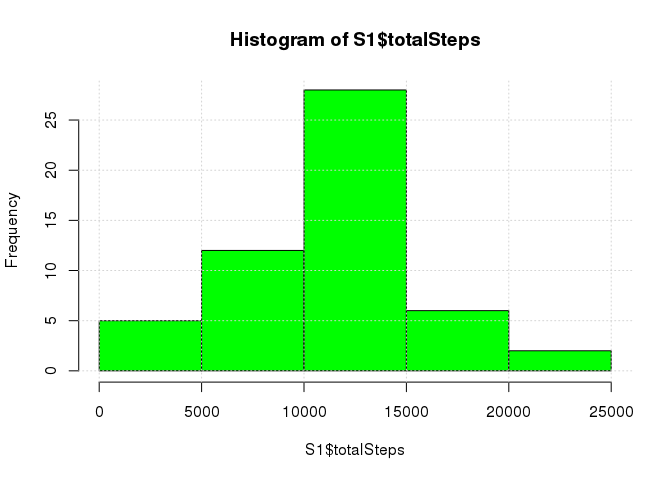
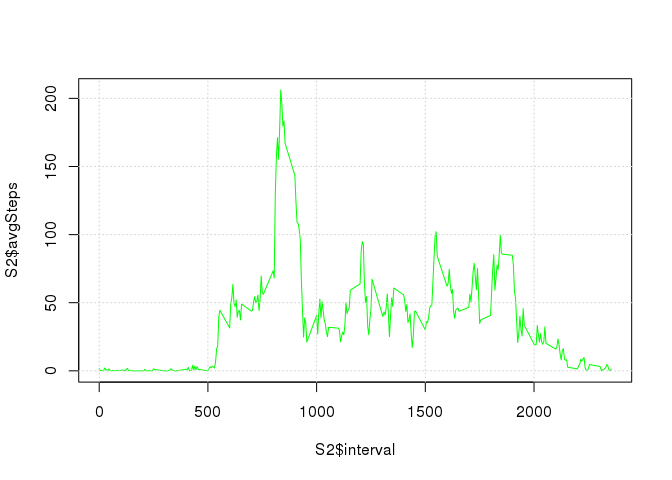
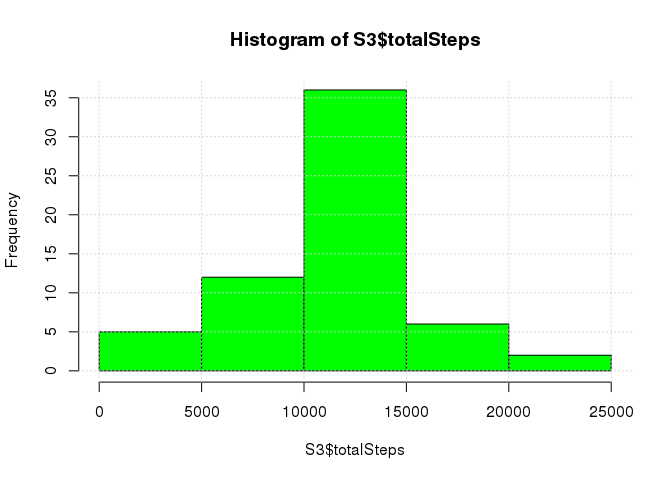
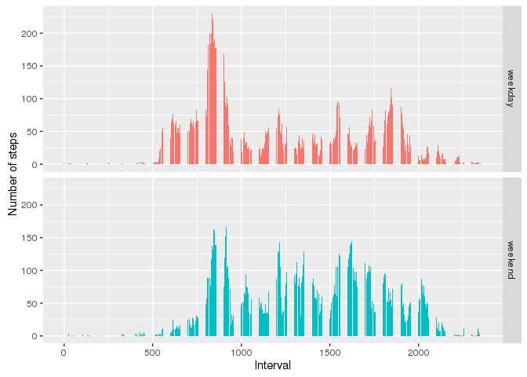

# Reproducible Research: Peer Assessment 1


## Loading and preprocessing the data

Let's start by loading the data and converting the string dates to POSIX objects:


```r
A <- read.csv("activity.csv")
A$date <- as.POSIXct(A$date)
```

Here are the first few rows of the loaded dataset:


```r
head(A)
```

```
##   steps       date interval
## 1    NA 2012-10-01        0
## 2    NA 2012-10-01        5
## 3    NA 2012-10-01       10
## 4    NA 2012-10-01       15
## 5    NA 2012-10-01       20
## 6    NA 2012-10-01       25
```

## What is the mean total number of steps taken per day?

As can be seen from the above output the dataset contains missing values. We'll ignore them in this part. We make a histogram of the total number of steps taken each day:


```r
library(plyr)
B <- A[!is.na(A$steps),]
S1 <- ddply(B, ~date, summarise, totalSteps=sum(steps))
hist(S1$totalSteps,col = 'green')
grid()
```

<!-- -->

Then calculate the mean and median of the total number of steps taken per day:


```r
mean(S1$totalSteps)
```

```
## [1] 10766.19
```

```r
median(S1$totalSteps)
```

```
## [1] 10765
```

## What is the average daily activity pattern?

To see the pattern we average the number of steps taken during each interval and plot the results. 


```r
S2 <- ddply(B,~interval,summarise,avgSteps=mean(steps))
plot(S2$interval,S2$avgSteps, t='l', col = 'green')
grid()
```

<!-- -->

As can be seen from the plot and by examining the data on average across all days the 835 interval contains the maximum number of steps - 206.1698 on average:


```r
S2[which.max(S2$avgSteps),]
```

```
##     interval avgSteps
## 104      835 206.1698
```


## Imputing missing values

As can be seen by exmamining the data the steps values are missing for some intervals. Let's examine the total number of missing values. It's 2304:


```r
count(is.na(A$steps))
```

```
##       x  freq
## 1 FALSE 15264
## 2  TRUE  2304
```

We will fix this by setting the missing values to the average number of steps for that intrerval across all days. We will use the dataframe (S2) calculated above and create a new dataframe C what will contain the old and the new values.


```r
C <- A
N <- dim(C)[1]
for(i in 1:N) {
  if (is.na(C[i,1])) {
    C[i,1] = S2[S2$interval == C[i,3], 2]
  }
}
```

Below is the new histogram and the updated mean and median values. As we can see because of the method we chose when assigning the missing values the overall mean value did not change, but the median did.


```r
S3 <- ddply(C, ~date, summarise, totalSteps=sum(steps))
hist(S3$totalSteps,col = 'green')
grid()
```

<!-- -->


```r
mean(S3$totalSteps)
```

```
## [1] 10766.19
```

```r
median(S3$totalSteps)
```

```
## [1] 10766.19
```

## Are there differences in activity patterns between weekdays and weekends?

Let's create a new factor variable in the dataset with two levels – “weekday” and “weekend” indicating whether a given date is a weekday or weekend day:


```r
C$dow <- as.factor(weekdays(C$date,TRUE))
C$wend <- as.factor(ifelse(C$dow == "Sun" | C$dow == "Sat", "weekend", "weekday"))
S4 <- ddply(C,~wend*interval,summarise,avgSteps=mean(steps))
```

Belowis a panel plot containing a time series plot of the 5-minute interval (x-axis) and the average number of steps taken, averaged across all weekday days or weekend days (y-axis). As can be seen from the plot the weekends are characterised by a higher level of walking activity.


```r
library(ggplot2)
ggplot(data=S4, aes(x=interval, y = avgSteps, fill = wend)) +
  geom_bar(stat="identity") +
  facet_grid(wend ~ .) +
  labs(x = "Interval", y = "Number of steps") +
  theme(legend.position="none")
```

<!-- -->
